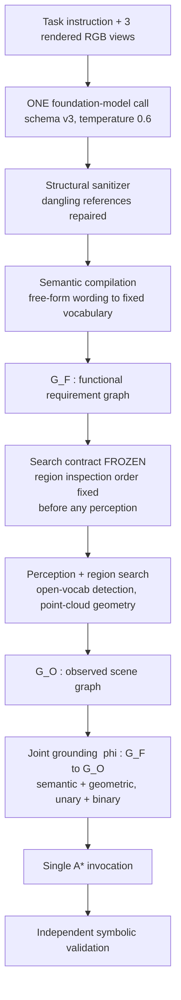

# GRAB-TAMP

Grounded functional task and motion planning from a single foundation-model
call.

A robot is given a task in natural language and three rendered views of a
scene, and must decide **what the task requires**, **which objects can play
those roles**, **where to look for the ones it cannot see**, and **what
sequence of actions achieves the goal** — without being told which object is
which. GRAB-TAMP makes exactly one foundation-model call, at the start. The
model's free-form answer is structurally sanitized and compiled into a
functional requirement graph over a small fixed vocabulary of roles,
capabilities, relations and regions — with a zero-shot NLI fallback that
resolves wording the hand-written cue tables do not cover. Everything after
that call is
deterministic: the region inspection order is frozen before any perception
runs, open-vocabulary detection and point-cloud geometry build an observed
scene graph, a joint grounding binds roles to observed objects subject to both
semantic and geometric constraints, and a single A\* invocation produces an
action sequence that an independent symbolic validator then checks. The
foundation model is never consulted again, so no failure can be repaired by
resampling it — which is what makes the reported numbers attributable to the
method rather than to retries.

## Pipeline



The four canonicalization vocabularies are fixed and small:

| layer | target vocabulary | size |
|---|---|---|
| role | `coffee_container`, `soup_eating_utensil`, `driver`, `fastener`, … | 6 / 6 / 3 per domain |
| capability | `STIR_COFFEE`, `TRANSFER_CONTENT_TO_CONTAINER`, `FASTEN_JOINT`, … | 7 total |
| relation | `INSERTABLE_IN`, `REACHES_BOTTOM`, `FITS_SET_ON`, … | 9 binary |
| region | `D1 D2 C1 C2 B1` (kitchen), `LEFT_DRAWER RIGHT_DRAWER TOOL_CABINET` (workshop) | 5 / 0 / 3 |

## Domains and evaluation variants

Three MuJoCo domains, 32 variants, 10 repeats each — **320 trials**.

| domain | variants | feasible | infeasible | inspectable regions |
|---|---|---|---|---|
| kitchen | K1–K12 | K1–K6 | K7–K12 | 5 |
| living_room | L1–L10 | L1–L6 | L7–L10 | **0** |
| workshop | W1–W10 | W1–W8 | W9, W10 | 3 |

A **feasible** variant admits a valid grounding and a complete plan; an
**infeasible** one does not, and the correct behaviour is to reject it rather
than to produce a plan. Infeasible variants are what make the *correct
rejection* and *false completion* metrics meaningful: a system that always
produces a plan scores zero on them.

Living Room declares **no inspectable regions** — everything is visible from
the start. It has no search stage and no recovery from a bad initial grounding,
which makes it a natural control: any measured difference between inspection
policies must be zero there by construction.

## Setup

Python 3.13 (pinned in `.python-version`).

```bash
python3 -m venv .venv && . .venv/bin/activate
pip install -r mujoco_scenes/requirements.txt -r requirements-test.txt
pip install -r requirements-zs.txt              # zero-shot canonicalization
python3 mujoco_scenes/scripts/prepare_semantic_models.py   # fetches detector + CLIP weights
```

**Models and checkpoints**

| role | model | notes |
|---|---|---|
| foundation model | `qwen35-9b`, served over an OpenAI-compatible endpoint | only needed for `--spec-source live` |
| open-vocabulary detector | YOLO-World `yolov8m-worldv2.pt` | fetched by `prepare_semantic_models.py` |
| detector embedding | CLIP `ViT-B-32` | same |
| canonicalization fallback | `MoritzLaurer/deberta-v3-large-zeroshot-v2.0-c` rev `b2730f16` | CPU, offline; also the alias-resolution study |

**Hardware.** Replaying the archived runs and regenerating every table needs
**no GPU** — the frozen foundation-model responses are on disk. Serving the
foundation model for a fresh `live` run needs a GPU with enough memory for a
9B vision-language model at a 32768-token context. MuJoCo simulation and
detection run on CPU.

## Reproducing the paper

### Every table, from the frozen run

No model calls, no simulation — seconds.

```bash
./run_benchmark.sh --tables-only
```

or directly:

```bash
PYTHONPATH=. python3 scripts/make_paper_tables.py \
    --assume-unscored-successful --out results/tables
```

This writes `results/tables/paper_tables.md` — Table III and both halves of
Table IV — from `benchmark_reports/zs4_top1/full_metrics.json`, the scored
320-trial run, plus `results/verification_ablation.json` and the
inspection-order aggregates.

Two definitions to read the tables by. **E2E succ.** is the share of feasible
trials satisfying *every* reference goal; that is not the same as matching the
reference action multiset, and the two diverge in workshop (62.5% against
47.5%), where a trial can reach the goal state by a different sequence. **CR**
counts an infeasible trial as correctly rejected when it produced no plan and
did not report `ACTION_SEQUENCE_READY`.

### One trial, end to end

```bash
./run_demo.sh                    # kitchen K3
./run_demo.sh workshop W2        # opens two regions, plans five actions
./run_demo.sh living_room L1     # no inspectable regions, no search stage
./run_demo.sh workshop W2 --physical   # drive the containers open with the robot
```

Replays the archived response, so no GPU and no model call; everything
downstream of the call runs for real. `examples/` holds one trial per domain
with every intermediate artifact — see [examples/README.md](examples/README.md),
which also explains why a fresh replay can differ from the archived result.

### The full 32-variant matrix

**The raw foundation-model response for all 320 trials is in this
repository** — `benchmark_reports/full320_s0{1,2,3}/**/fm_diagnostics/fm_call_001.json`,
4.3 MB in total. Every replay arm and every ablation therefore runs with no
GPU and no model access, recompiling from the model's own words:

```bash
# The reported configuration: zero-shot canonicalization fallback enabled,
# recompiled from the raw responses. This is the arm every table is computed
# from; scripts/evaluate_vlm_zs_canonicalization.py installs the fallback and
# then calls the unmodified evaluator.
TAMP_ZS_MIN_SCORE=0.0 TAMP_ZS_MIN_MARGIN=0.0 \
PYTHONPATH=. python3 scripts/evaluate_vlm_zs_canonicalization.py \
    --specification-root benchmark_reports/full320_s01/repeat_01/attempt_01 \
    --output-root results/runs/replay

# Without the fallback, to pair against on the same commit.
PYTHONPATH=. python3 scripts/evaluate_vlm_zs_canonicalization.py --baseline \
    --specification-root benchmark_reports/full320_s01/repeat_01/attempt_01 \
    --output-root results/runs/replay_baseline

# A fresh live run instead: requires the model served at the given endpoint.
PYTHONPATH=. python3 scripts/run_live_repeat_experiment.py \
    --output-root results/runs/live --repeats 10 \
    --base-url http://127.0.0.1:8000/v1 --model qwen35-9b
```

`--spec-source` decides where the specification comes from, and this is the
distinction that matters most for reproducibility:

| value | source | model called? |
|---|---|---|
| `live` | a fresh call per trial | **yes** |
| `replay` | the archived compiled `functional_specification.json` | no |
| `raw-replay` | the archived raw response `fm_diagnostics/fm_call_001.json` | no |

**Use `raw-replay` for any change to canonicalization**, because it re-runs
compilation from the model's own words. `replay` loads the already-compiled
specification and would carry the old mapping forward unchanged, which silently
reproduces the baseline and reads as a clean null result.

`run_live_repeat_experiment.py` owns the frozen sampler — nine settings held
fixed across every trial, including 3 views and a presence penalty of 1.0.
Import `SAMPLER` from it rather than restating them: an earlier runner that
redeclared only `max_tokens` and `enable_thinking` dropped the presence
penalty, the model ran away, and two arms became incomparable.

### Scoring a run you produced

```bash
PYTHONPATH=. python3 scripts/score_full_experiment.py \
    --root results/runs/replay --out results/runs/replay
```

## Ablations

Every ablation runs as a **shadow**: a context manager patches named functions
in process, runs the unmodified evaluator, and restores them on exit. No
pipeline file is edited, and each arm replays the frozen responses, so no arm
can differ from another because the model happened to answer differently.

| shadow | patches | what it ablates |
|---|---|---|
| `mujoco_scenes/fm_evidence_ablation.py`, `fm_ablation_shadow.py` | `grounding.ground_graph` | withhold semantic / unary geometric / binary relational evidence |
| `mujoco_scenes/fm_search_order_shadow.py` | `run.search_until_satisfied`, the domain `run_to_plan` functions | region inspection order, with phase timing |
| `mujoco_scenes/fm_worst_case_order.py` | the inspection order | privileged adversarial order |

`mujoco_scenes/fm_zs_canonicalization_shadow.py` uses the same mechanism but is
**part of the reported method, not an ablation**: it installs the zero-shot
fallback on the four canonicalization resolvers. It is augment-only — the
hand-written cue table is consulted first and the NLI model runs only where
that returns nothing — so it cannot change a trial the cue tables already
resolve. `--baseline` turns it off for a paired comparison.

### Evidence ablation — semantic / unary / binary

```bash
PYTHONPATH=. python3 scripts/run_fm_evidence_ablation.py \
    --output-root results/runs/evidence
PYTHONPATH=. python3 scripts/evaluate_vlm_ablation.py --help   # per-arm driver
```

Results: `results/evidence_ablation/`.

### Inspection order — FM-ranked vs seeded-random vs worst case

```bash
for arm in auto random worst; do
  PYTHONPATH=. python3 scripts/run_search_order_replay_timing.py \
      --scored-json benchmark_reports/FINAL_10x32_RESULTS/rescored_current_scorer.json \
      --output-root results/runs/order_$arm --order-mode $arm
done

PYTHONPATH=. python3 scripts/score_inspection_order_ablation.py \
    --fm results/runs/order_auto --random results/runs/order_random \
    --out results/order_fm_vs_random.json
PYTHONPATH=. python3 scripts/score_inspection_order_ablation.py \
    --fm results/runs/order_auto --random results/runs/order_worst \
    --out results/order_fm_vs_worst.json
PYTHONPATH=. python3 scripts/score_inspection_open_cost.py \
    --arms order_auto order_random order_worst --out results/order_open_cost.json
```

The random arm derives its seed per trial by SHA-256 over
`(seed_base, output_root, domain, variant)`, so an order is random across
trials but reproducible for any single trial. The worst-case arm is
**privileged**: it reads which regions are empty from the scene configuration —
ground truth the pipeline never sees — and opens those first. It bounds what
bad ordering can cost; it is not a baseline any policy could produce.

Grounding time is only interpretable within one machine. Run the arms back to
back with nothing else competing, and read the Living Room cells first: that
domain has no inspectable regions, so all arms run it identically, and whatever
difference it still shows is the measurement floor. Reported opening cost
avoids the problem entirely — it is measured per-region actuation time
multiplied by which regions were opened, with no wall clock in it.

### Alias resolution — zero-shot NLI for canonicalization

```bash
pip install -r experiments/alias_resolution_study/requirements.txt
PYTHONPATH=. python3 experiments/alias_resolution_study/run_zero_shot_layers.py
PYTHONPATH=. python3 experiments/alias_resolution_study/evaluate.py
```

Offline, CPU, no foundation-model calls. Asks whether a zero-shot NLI model can
map free-form wording onto the fixed vocabularies, across all four layers. The
result that matters is the effect of context: on identical phrases and an
identical label set, top-1 agreement on the relation layer goes from **0.370**
when the model sees the phrase alone to **0.866** when it also sees the
argument types and the endpoint identities. See
`experiments/alias_resolution_study/README.md`.

## Ground truth

Ground truth is used **only** for offline scoring and is never read at runtime.

| path | contents |
|---|---|
| `GT_GOAL_COVERAGE/` | per-variant goal definitions, for goal coverage |
| `GT_VALID_ROLE_ASSIGNMENTS/` | admissible role→object bindings, for assignment coverage |
| `GT_ROLE_ASSIGNMENTS/` | reference role assignments |
| `GT_everything/` | reference action sequences and role assignments per variant |

That separation is enforced rather than asserted:

```bash
PYTHONPATH=. python3 scripts/audit_no_gt_leakage.py
```

The audit fails if anything under `mujoco_scenes/functional_tamp_pipeline/`
reads ground-truth feasibility, identities, roles, success, inventories or
expected answers, or branches on a variant name or trial index.

## Layout

```
mujoco_scenes/
  functional_tamp_pipeline/   the method: sanitizer, semantic compiler, search
                              contract, grounding, planning, validation
    domains/                  kitchen, living_room, workshop entry points
    outcome_classifier.py     the first-cause failure taxonomy
  assets/                     MuJoCo scenes, meshes, textures
  configs/                    scene, vocabulary, rig and variant definitions
  KITCHEN_ENVIRONMENT.md      kitchen region geometry and contents
  WORKSHOP_ENVIRONMENT.md     workshop region geometry and contents
  fm_*_shadow.py              ablation shadows
scripts/                      evaluation, scoring and table generation
experiments/
  alias_resolution_study/     zero-shot canonicalization study
GT_*/                         evaluation-only ground truth
benchmark_reports/
  zs4_top1/                   the reported run: scored metrics and per-trial
                              outcome records
  full320_s0{1,2,3}/          the raw foundation-model response for all 320
                              trials, plus outcome and manifest records
results/                      generated tables and ablation aggregates
examples/                     one archived trial per domain, every stage
docs/PIPELINE.md              stage-by-stage reference, failure modes,
                              open problems
```

## Known open problems

Documented in full in [docs/PIPELINE.md](docs/PIPELINE.md).

**Role collisions.** Two distinct foundation-model roles resolving to the same
canonical role (`AMBIGUOUS_ROLE_MAPPING`, 75 occurrences) is the largest single
sub-cause of the dominant failure stage. A fallback that only fires when the
mapper returns nothing can never help: the mapper already returned an answer,
and the answer is the problem.

**One model role, two canonical roles.** Living Room's characteristic failure.
The model writes a single `placement_surface` whose own stated function covers
both the refreshments and the entertainment control. It canonicalizes to
`PERSONAL_CUP_SAUCER_REGION`, and `SUPPORT_ENTERTAINMENT_CONTROL` then finds no
capability whose target signature accepts it, so the remote placement is
dropped — the affected trials place the drinkware correctly and stop two
actions short. Fixing it means role resolution becoming **operation-relative**
rather than one canonical name per model role, which is a design change rather
than a patch.
