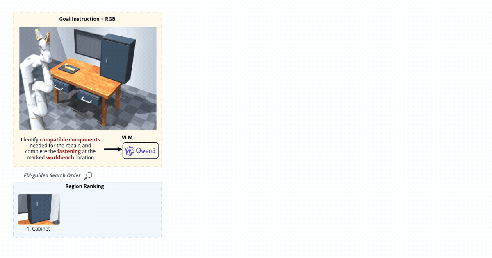
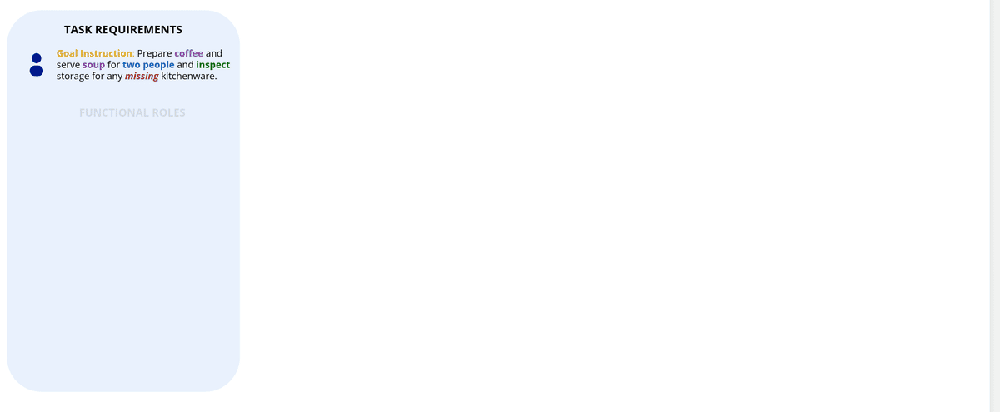

<div align="center">

# GRAB-TAMP

**Search, Ground, Plan: Functional Sufficiency for Task and Motion Planning under Incomplete Scene Knowledge**

[Ground truth](#ground-truth-executions) • [Setup](#setup) • [Quick start](#quick-start) • [Results](#results) • [Layout](#layout)




</div>

---

### Table of Contents

- [Overview](#overview)
- [Ground-truth executions](#ground-truth-executions)
- [Setup](#setup)
- [Quick start](#quick-start)
- [Domains and variants](#domains-and-variants)
- [Results](#results)
- [Reproducing the paper](#reproducing-the-paper)
- [Relation alias resolution](#relation-alias-resolution)
- [Notation → files](#notation--files)
- [Layout](#layout)
- [Citation](#citation)

# Overview



Incomplete scene knowledge leaves a gap between understanding *what a task
requires* and knowing *whether the physical scene can realize it*. A suitable
object may be occluded, inside an articulated region, or out of view — and its
absence from the current observation does not make the task infeasible. A newly
observed object may also be irrelevant, or semantically right but geometrically
wrong.

**GRAB-TAMP searches for the entities a task needs, grounds functional roles to
valid physical objects, and plans only once a complete joint assignment
establishes functional sufficiency.**

One foundation-model call turns the instruction and initial RGB observation into
a task specification — functional roles, relations, assignment constraints, a
perception vocabulary and a region inspection ranking. The scene is then
inspected incrementally while requirements remain unresolved; candidates are
verified semantically, unary-geometrically and relationally; and the joint
object–role assignment is frozen before the symbolic planner runs.

Assignments need not be one-to-one — objects may be reused, regions shared, and
several candidates may satisfy the same role — so roles are grounded *together*
rather than independently. The FM is never called again, which is why GRAB-TAMP
reports no replans in Table III.

# Ground-truth executions

Recorded robot executions of the reference plans, the action-sequence reference
for scoring. Full sequences in `ground_truth/execution_reference.json`.

| variant | actions | exec. (s) | | variant | actions | exec. (s) |
|---|---:|---:|---|---|---:|---:|
| kitchen/K1 | 24 | 526.7 | | living_room/L4 | 19 | 263.5 |
| kitchen/K2 | 27 | 618.9 | | living_room/L5 | 16 | 234.0 |
| kitchen/K3 | 25 | 657.1 | | living_room/L6 | 20 | 279.7 |
| kitchen/K4 | 28 | 708.1 | | workshop/W1 | 6 | 390.3 |
| kitchen/K5 | 26 | 542.7 | | workshop/W2 | 6 | 380.3 |
| living_room/L1 | 20 | 278.0 | | workshop/W3 | 7 | 545.6 |
| living_room/L2 | 16 | 225.3 | | workshop/W4 | 7 | 499.3 |
| living_room/L3 | 20 | 272.1 | | | | |

<details>
<summary>Example — <code>workshop/W1</code></summary>

```
OPEN(LEFT_DRAWER)
PICK(workshop_medium_phillips_screw, LEFT_DRAWER)
PLACE(workshop_medium_phillips_screw, workshop_frame_joint)
PICK(workshop_long_phillips_driver, LEFT_DRAWER)
SCREW(workshop_long_phillips_driver, workshop_medium_phillips_screw, workshop_frame_joint)
PLACE(workshop_long_phillips_driver, MAIN_WORKBENCH_ZONE)
```

</details>

# Setup

Python 3.13.

```bash
python3 -m venv .venv && . .venv/bin/activate
pip install -r requirements.txt -r requirements-zs.txt
python3 mujoco_scenes/scripts/prepare_semantic_models.py    # detector + CLIP weights
```

> [!IMPORTANT]
> Install both requirement files in **one** `pip` call, as above — separate
> calls can resolve torchvision against the wrong torch. On a headless machine
> set `MUJOCO_GL=egl`. If `python3 -m venv` reports that `ensurepip` is
> unavailable, install the distribution's `python3-venv` package or use conda
> (`conda create -n grab python=3.13`).

| component | model |
|---|---|
| foundation model | **Qwen 3.5-9B**, full unquantized weights, served through vLLM (only for `--live`) |
| open-vocabulary detector | YOLO-World `yolov8m-worldv2.pt` |
| detector embedding | CLIP `ViT-B-32` |
| relation alias resolution | DeBERTa zero-shot NLI, `MoritzLaurer/deberta-v3-large-zeroshot-v2.0-c` (CPU) |

**Hardware.** All experiments in the paper were run on an inference server with a
single **NVIDIA RTX PRO 5000 Blackwell** (32 GB) serving the foundation model
through vLLM; simulation, detection and point-cloud geometry run on CPU.

> [!NOTE]
> **Reproducing the tables needs no GPU and no model access.** The raw FM
> response for all 320 trials ships in `data/reference_run/`, and every result
> is recompiled from it. A replay of all 32 variants takes about 15 minutes on
> CPU.

The scene loader can also compose two other robot backends — Fetch, via
`gymnasium-robotics`, and Google Robot, via a MuJoCo Menagerie checkout
(`MUJOCO_MENAGERIE_PATH`). Neither is needed for the reported tables, and
neither is in the requirements; see `mujoco_scenes/THIRD_PARTY_NOTICES.md`.

# Quick start

```bash
./run_demo.sh                          # kitchen K3
./run_demo.sh workshop W2
./run_demo.sh living_room L1
```

```
status          ACTION_SEQUENCE_READY
regions opened  ['C1', 'C2', 'D1', 'D2', 'B1']
role binding    {'coffee_container': ['object_0001', 'object_0002'],
                 'coffee_stirrer': 'object_0004', 'water_source': 'object_0007', ...}
action sequence:
   1. PICK(object_0005)
   2. PLACE_SERVING_UTENSIL(object_0005, object_0003)
   ...
  20. PLACE(object_0002, dining_table)
```

# Domains and variants

32 scene variants, 10 trials each — **320 trials**. 20 feasible, 12 infeasible.
Each scene is observed through a fixed three-view camera configuration.

| domain | goal instruction | functional relations | candidate regions | F / I |
|---|---|---|---|---|
| **Kitchen** | Prepare and serve one coffee and one soup for each of two people. Make each coffee using coffee and water and stir it before serving. Serve each soup bowl with its own suitable eating utensil. | `OPEN_CAVITY`, `ELONGATED_OBJECT`, `INSERTABLE_IN`, `REACHES_BOTTOM` | countertop, drawers D1–D2, cabinets C1–C2, bin B1 | 6 / 6 |
| **Living Room** | Prepare the living room for two people to enjoy refreshments while watching television. Provide each person with their own refreshment setting nearby, and place the entertainment control where it is accessible to both people. | `PLANAR_SUPPORT`, `FITS_ON`, `FITS_SET_ON`, `NEAR_SEAT` | left and right personal side tables, shared coffee table | 6 / 4 |
| **Workshop** | Identify the compatible components required to complete the fastening at the marked workbench location, complete the fastening, and leave any reusable equipment used for the task safely on the workbench. | `GRASPABLE`, `FITS_TOOL_HEAD`, `FITS_IN`, `NEAR_WORKPIECE` | left drawer, right drawer, tool cabinet, marked workbench target | 8 / 2 |

Kitchen hides objects across multiple storage regions with varying cardinality
and reuse requirements; Living Room is fully observable with shared-region
constraints; Workshop has alternative tools and a hidden distractor.

# Results

`./run_benchmark.sh` regenerates both tables into `results/tables/paper_tables.md`
from `data/metrics/`.

### Metrics

Feasible and infeasible variants are scored separately, because they measure
different behaviours. For trial *i*, G_i is the set of required task goals and
Ĝ_i the subset the generated plan achieves.

**PGC** — Plan Goal Coverage, Eq. (9)

```
PGC = (1/N_F) · Σ ( |G_i ∩ Ĝ_i| / |G_i| ) × 100
```

Partial credit when a plan achieves only part of the task.

**E2E Success**, Eq. (10)

```
E2E = (1/N_F) · Σ s_i × 100      s_i ∈ {0,1}
```

Whether feasible trial *i* satisfies all task goals after execution.

**CR** — Correct Rejection, Eq. (11)

```
CR = (1/N_I) · Σ (1 − C_i) × 100 = 100 − Commit
```

An infeasible task identified without committing to a plan.

### Table III — end to end

| Domain | N_F | PGC | E2E succ. | Avg. replans | N_I | CR |
|---|---:|---:|---:|:---:|---:|---:|
| Kitchen | 60 | 82.8 | 65.0 | – | 60 | 50.0 |
| Living Room | 60 | 48.7 | 31.7 | – | 40 | 70.0 |
| Workshop | 80 | 69.6 | 62.5 | – | 20 | 20.0 |
| **Overall** | **200** | **67.3** | **54.0** | **–** | **120** | **51.7** |

<sub>Baseline comparisons are in the paper. `–` in Avg. replans is a property of
the method: one FM call, never resampled.</sub>

### Table IV — verification ablation

GT role and relation slots classified correct / wrong / missing, with the share
of functional assignment coverage in parentheses. Kitchen and Living Room use
13 G_O nodes per trial, Workshop 6.

| Scene | Verification | Trials | Correct G_O | Wrong G_O | Missing G_O |
|---|---|---:|---:|---:|---:|
| **Kitchen** | Semantic only | 60 | 96 (12.3) | 19 (2.4) | 665 (85.3) |
| | + Unary | 60 | 103 (13.2) | 21 (2.7) | 656 (84.1) |
| | **+ Binary** | 60 | **514 (65.9)** | 63 (8.1) | **203 (26.0)** |
| **Living Room** | Semantic only | 60 | 141 (18.1) | 1 (0.1) | 638 (81.8) |
| | + Unary | 60 | 96 (12.3) | 3 (0.4) | 681 (87.3) |
| | **+ Binary** | 60 | **439 (56.3)** | 20 (2.6) | **321 (41.2)** |
| **Workshop** | Semantic only | 80 | 86 (17.9) | 13 (2.7) | 381 (79.4) |
| | + Unary | 80 | 47 (9.8) | 8 (1.7) | 425 (88.5) |
| | **+ Binary** | 80 | **239 (49.8)** | 55 (11.5) | **186 (38.8)** |
| **Overall** | Semantic only | 200 | 323 (15.8) | 33 (1.6) | 1684 (82.5) |
| | + Unary | 200 | 246 (12.1) | 32 (1.6) | 1762 (86.4) |
| | **+ Binary** | 200 | **1192 (58.4)** | 138 (6.8) | **710 (34.8)** |

### Table IV — inspection-order ablation

FM-derived ranking π_R against a fixed inspection order, rest of the pipeline
unchanged. Total time is region-opening cost plus grounding time.

| Scene | Order | Regions inspected | Candidate checks | Total time (s) |
|---|---|---:|---:|---:|
| **Kitchen** | Fixed order | 4.33 | 134.6 | 82.94 |
| | **FM-ranked** | **3.91** | **134.6** | **76.22** |
| **Living Room** | Fixed order | 0.00 | 23.2 | 6.77 |
| | **FM-ranked** | **0.00** | **23.2** | **6.77** |
| **Workshop** | Fixed order | 2.58 | 14.2 | 287.64 |
| | **FM-ranked** | **2.32** | **13.4** | **268.20** |

The fixed order is a per-variant sequence that does not use the FM ranking and
visits regions in ascending order of how much they hold, so regions holding
nothing are opened first (`mujoco_scenes/fm_fixed_order.py`). It is a
reference order, not something the method can produce: deriving it needs the
region contents, which the pipeline is never given.

Living Room is unchanged because it declares no inspectable regions — all
task-relevant entities are initially visible — which also makes it a control for
timing drift.

A **seeded random** order is also implemented, reseeded per trial from a hash of
`(seed_base, output_root, domain, variant)` so it is unpredictable across trials
and reproducible within one. Run any arm with
`scripts/run_search_order_replay_timing.py --order-mode {auto,random,fixed}` and
score it with `scripts/score_inspection_order_ablation.py`, which reports paired
per-scene means with confidence intervals and a Wilcoxon signed-rank test, and
checks that the arms agree on every trial's terminal status.

# Reproducing the paper

| item | entry point |
|---|---|
| a single trial's action sequence | `./run_demo.sh <domain> <variant>` |
| verification ablation | `scripts/run_fm_evidence_ablation.py` |
| inspection-order arms | `scripts/run_search_order_replay_timing.py`, then `scripts/score_inspection_order_ablation.py` |
| relation alias resolution (Sec. VI) | `experiments/alias_resolution_study/` |
| ground-truth isolation | `scripts/audit_no_gt_leakage.py` |

Each trial declares an action sequence from the archived foundation-model
response; compilation is deterministic, so the only stochastic component in the
pipeline is removed.

> [!NOTE]
> Ground truth is read only by the offline scoring scripts, never at runtime.
> `scripts/audit_no_gt_leakage.py` fails if the pipeline reads ground-truth
> feasibility, identities, roles, success, inventories or expected answers, or
> branches on a variant name or trial index.

# Relation alias resolution

Equivalent functional relations are phrased differently across FMs and prompts,
while the execution layer needs a fixed predicate vocabulary. Both routes the
paper's discussion names are implemented: hand-written aliases, and a zero-shot
NLI fallback consulted only where the aliases return nothing
(`mujoco_scenes/fm_zs_canonicalization_shadow.py`, enabled in the reported
configuration). `experiments/alias_resolution_study/` measures it offline.

# Notation → files

The paper's symbols map directly onto per-trial artifacts:

| paper | meaning | file |
|---|---|---|
| Ψ | task specification, Eq. (3) | `functional_specification.json` |
| G_F | functional requirements, Eq. (2) | `functional_requirement_graph.json` |
| G_O^k | observed graph at step *k*, Eq. (4) | `observed_scene_graph.json` |
| φ\* | frozen joint assignment | `graph_grounding_result.json` |
| V_g, π_R | perception vocabulary, region ranking | `run_manifest.json` (`region_order_used`) |
| π | action sequence | `result.json` (`plan`) |

# Layout

```
mujoco_scenes/functional_tamp_pipeline/   the method
mujoco_scenes/{assets,configs}/           the three scenes and the 32 variants
mujoco_scenes/fm_*_shadow.py              in-process shadows: the zero-shot
                                          relation fallback, and the evidence
                                          and inspection-order ablations
scripts/                                  evaluation, scoring, table generation
ground_truth/                             evaluation-only reference data
data/reference_run/                       32 archived FM responses and outcomes
data/metrics/                             the aggregates the tables are built from
experiments/alias_resolution_study/       zero-shot relation-alias study
```

# Citation

```bibtex
@inproceedings{grabtamp,
  title     = {Search, Ground, Plan: Functional Sufficiency for Task and Motion
               Planning under Incomplete Scene Knowledge},
  booktitle = {Under review},
  year      = {2026}
}
```
